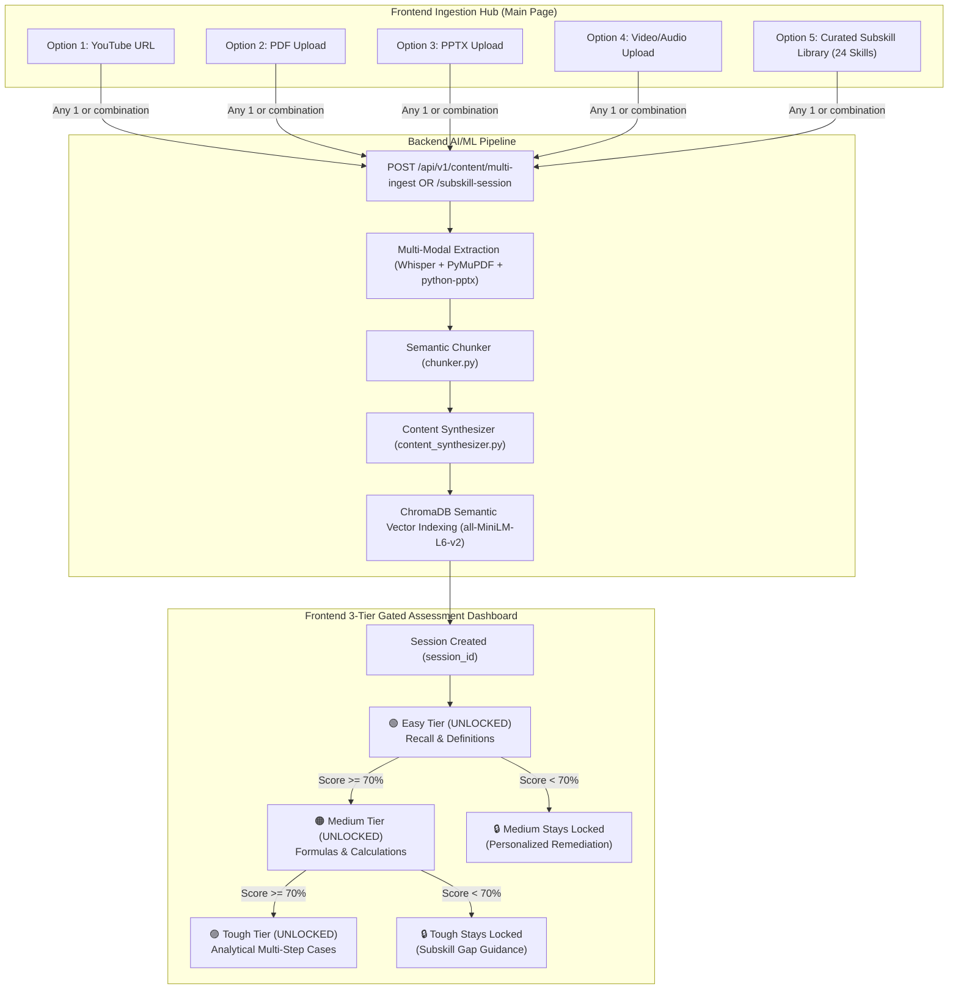

# Devraj's Frontend Integration Guide: GyanSetu Multi-Modal Ingestion, Subskills Library & 3-Tier Gated Assessment

**Target Audience:** Devraj (Frontend Lead)  
**Backend/ML Engine:** GyanSetu AI/ML Architecture (FastAPI + Groq + ChromaDB + BKT/IRT + SentenceTransformers)  
**Version:** 2.5 (Multi-Modal, 24 Subskills Library & 3-Tier Gated Assessment Release)

---

## 1. Executive Summary & Architecture Flowchart

GyanSetu provides learners with **5 primary entry pathways** on the main application hub:

1. 🎥 **YouTube Video / Shorts Link** (Captions + Whisper audio transcription)
2. 📄 **PDF Document** (PyMuPDF text, table extraction, OCR scanned page fallback)
3. 📊 **PowerPoint Presentation (.pptx)** (Slide text, bullet points, presenter notes)
4. 🎙️ **Local Video / Audio File (.mp4, .webm, .mp3, .wav)** (Whisper transcription)
5. 🎯 **Curated Subskills & Competency Library (24 Statistical Subskills)** (Instant targeted practice without uploading files)

### Flexible Ingestion Combinations
The learner can choose:
* **Single source**: e.g., only a YouTube link, or only a PDF, or pick 1 subskill from the library.
* **Dual / Triple / Quad source**: e.g., YouTube video + Lecturer's PPTX + PDF reference notes.
* **Hybrid**: Pick a subskill from the library (e.g., *Bayes' Theorem*) **AND** upload personal lecture notes to ground the assessment in both!

When multiple sources are submitted, the AI/ML pipeline:
- Transcribes and parses all inputs into semantic knowledge chunks.
- Runs **`content_synthesizer.py`** to eliminate duplicates and merge cross-source insights.
- Embeds all content using **`all-MiniLM-L6-v2` dense semantic vectors** in **ChromaDB**.
- Builds a targeted **3-Tier Gated Assessment** (`Easy` ➡️ `Medium` ➡️ `Tough`).



---

## 2. Frontend Screen 1: Multi-Modal & Subskill Ingestion Hub

Devraj, design the landing screen with **two coordinated pathways** (or tabs):
1. **Pathway 1: Custom Media Ingestion (Tiles 1 to 4)**
2. **Pathway 2: Curated Subskills Library (Tile 5 / Subskills Catalog)**

---

### 2.1 The 5 Ingestion Options

```
+---------------------------------------------------------------------------------------------------+
|                                     GYANSETU LEARNING HUB                                         |
|                                                                                                   |
|  [ Pathway 1: Upload Your Custom Materials ]            [ Pathway 2: Targeted Subskill Practice ] |
|                                                                                                   |
|  +-----------------------+  +-----------------------+   +---------------------------------------+ |
|  | 🎥 YouTube Link       |  | 📄 PDF Document       |   | 🎯 Select From Curated Subskills      | |
|  | [ Enter YouTube URL ] |  | [ Drop .pdf file ]    |   | 5 Competencies | 24 Official Subskills| |
|  +-----------------------+  +-----------------------+   |                                       | |
|                                                         | [ Dropdown / Searchable Modal       ] | |
|  +-----------------------+  +-----------------------+   | e.g. "Bayes' Theorem", "Stratified"   | |
|  | 📊 PowerPoint (.pptx) |  | 🎙️ Video / Audio File |   |                                       | |
|  | [ Drop .pptx file ]   |  | [ Drop .mp4 / .mp3 ]  |   | [ Selected: Bayes' Theorem & Cond.  ] | |
|  +-----------------------+  +-----------------------+   +---------------------------------------+ |
|                                                                                                   |
|                  [ Primary CTA: "Launch Assessment & Build Knowledge Base" ]                      |
+---------------------------------------------------------------------------------------------------+
```

#### Input Field Details
1. **YouTube Link Tile**:
   - URL text input with regex validation (`https://www.youtube.com/watch?v=...`, `https://youtu.be/...`).
   - Shows a green checkmark once a valid URL is typed.
2. **PDF Upload Tile**:
   - Drag & drop zone accepting `.pdf`.
   - Displays uploaded file name, byte size, and an `(x)` remove button.
3. **PowerPoint Tile**:
   - Drag & drop zone accepting `.pptx`.
   - Displays uploaded file name, byte size, and an `(x)` remove button.
4. **Video / Audio Tile**:
   - Drag & drop zone accepting `.mp4`, `.webm`, `.mov`, `.mp3`, `.wav`, `.m4a`.
   - Displays uploaded file name, byte size, and an `(x)` remove button.
5. **Curated Subskills Selector**:
   - Searchable combobox or button that opens a **Subskill Picker Modal**.
   - Displays the selected subskill badge (e.g. `🏷️ Bayes' Theorem & Conditional Probability`).
   - Clear button to deselect.

---

### 2.2 Official Catalog: 24 Curated Statistical Subskills

Devraj, you can fetch these live from `GET /api/v1/content/subskills` or hardcode this catalog as a fallback. They are categorized under 5 core competencies:

| Competency ID & Name | Subskill ID | Subskill Display Name | Typical Topic / Scope |
| :--- | :--- | :--- | :--- |
| **COMP-01: Probability Theory & Random Variables** | `sub_prob_01` | **Bayes' Theorem & Conditional Probability** | Prior/posterior odds, Bayes formula, diagnostic tests |
| | `sub_prob_02` | **Law of Total Probability & Independence** | Partition of sample space, mutually exclusive events |
| | `sub_prob_03` | **Discrete Distributions (Binomial & Poisson)** | PMF, Poisson approximation, Bernoulli trials |
| | `sub_prob_04` | **Continuous Distributions (Normal & Exponential)** | PDF, CDF, standard normal z-scores, memoryless property |
| | `sub_prob_05` | **Expectation, Variance & Covariance Properties** | Linear combinations of random variables, moments |
| | `sub_prob_06` | **Law of Large Numbers (Weak & Strong)** | Convergence in probability, sample mean consistency |
| | `sub_prob_07` | **Central Limit Theorem (CLT)** | Asymptotic normality, sample size thumb-rules ($n \ge 30$) |
| **COMP-02: Sampling Design & Survey Methodology** | `sub_samp_01` | **Simple Random Sampling (SRSWR & SRSWOR)** | Inclusion probabilities, standard errors, finite population correction |
| | `sub_samp_02` | **Stratified Random Sampling & Neyman Allocation** | Homogeneous strata, variance reduction, optimal allocation |
| | `sub_samp_03` | **Systematic Sampling & Circular Systematic Selection** | Periodic variations, sampling interval $k = N/n$ |
| | `sub_samp_04` | **Cluster Sampling & Two-Stage Design** | Intra-class correlation coefficient, multi-stage PSU/SSU |
| | `sub_samp_05` | **Non-Sampling Errors & Frame Imperfections** | Non-response bias, imputation methods, measurement errors |
| **COMP-03: National Accounts & Macroeconomic Aggregates** | `sub_macro_01`| **GDP Compilation (Production, Income, Expenditure)** | Three approaches to GDP, boundary of production |
| | `sub_macro_02`| **Gross Value Added (GVA) at Basic vs Producer Prices** | Product taxes/subsidies, intermediate consumption |
| | `sub_macro_03`| **Capital Formation & Consumption of Fixed Capital (CFC)**| GFCF, inventory changes, depreciation vs CFC |
| | `sub_macro_04`| **Supply and Use Tables (SUT) & Input-Output Framework**| Commodity flows, balancing supply and demand |
| **COMP-04: Price Indices & Inflation Analytics** | `sub_price_01`| **Laspeyres, Paasche & Fisher Ideal Price Indices** | Base-weighted vs current-weighted index, time reversal test |
| | `sub_price_02`| **Consumer Price Index (CPI) Basket Weighting** | Cost-of-living index, household consumer expenditure surveys |
| | `sub_price_03`| **Wholesale Price Index (WPI) & GDP Deflator** | Headline vs core inflation, implicit price deflator |
| | `sub_price_04`| **Index of Industrial Production (IIP) Weighting** | Manufacturing, mining, electricity sector index |
| **COMP-05: Statistical Inference & Hypothesis Testing** | `sub_inf_01`  | **Point Estimation & Confidence Intervals** | Unbiasedness, consistency, 95% confidence intervals |
| | `sub_inf_02`  | **Hypothesis Testing (Type I & II Errors, p-values)** | Significance level $\alpha$, statistical power $1 - \beta$ |
| | `sub_inf_03`  | **Chi-Square Test of Independence & Goodness-of-Fit** | Contingency tables, expected frequencies, degrees of freedom |
| | `sub_inf_04`  | **One-Way & Two-Way ANOVA** | F-statistic, between vs within sum of squares |
| | `sub_inf_05`  | **Ordinary Least Squares (OLS) Linear Regression** | Gauss-Markov assumptions, $R^2$, residual diagnostics |

---

### 2.3 Live Ingestion Stepper Modal

While backend processing takes place, show the 4-step live progress modal:

```
[✓] 1. Extracting Text & Transcribing Audio (Groq Whisper)
[✓] 2. Segmenting into Semantic Knowledge Chunks
[🔄] 3. Cross-Modal Deduplication (content_synthesizer.py)
[ ] 4. Vector Store Indexing (all-MiniLM-L6-v2) & 3-Tier Assessment Generation
```

If the user launched via **Option 5 (Subskill Library)** with no uploaded files, steps 1–3 complete instantly (<1s), loading pre-calibrated questions directly into the 3-Tier Assessment!

---

## 3. Frontend Screen 2: 3-Tier Gated Assessment Dashboard

Once the session is initialized, the user arrives at the **3-Tier Gated Assessment Dashboard**.

### 3.1 The 3 Gated Tiers

| Tier | Badge | Difficulty | Cognitive Level (Bloom) | Initial State | Unlock Condition |
| :--- | :--- | :--- | :--- | :--- | :--- |
| **Tier 1: Easy** | 🟢 Green | Easy | Remember & Understand (Core definitions, terminology) | **UNLOCKED** | Always available |
| **Tier 2: Medium** | 🟠 Orange | Medium | Apply & Analyze (Formulas, real computations, comparisons) | **LOCKED 🔒** | Must score **$\ge 70\%$** on Tier 1 (Easy) |
| **Tier 3: Tough** | 🟣 Purple | Hard | Evaluate & Synthesize (Multi-step algebra, policy trade-offs) | **LOCKED 🔒** | Must score **$\ge 70\%$** on Tier 2 (Medium) |

### 3.2 Locked vs. Unlocked Button Behaviors
* **Unlocked Tier Card**:
  - Interactive border glow, full opacity.
  - Button text: **"Start Assessment (5 Questions)"**.
  - If already completed: Displays score badge: `Score: 80% (PASSED)` + secondary button: `Retake`.
* **Locked Tier Card**:
  - Grayed-out background (`opacity: 0.55`), padlock icon `🔒`.
  - Cursor: `not-allowed`.
  - Tooltip on hover:
    - On Medium: *"Complete the Easy tier with $\ge 70\%$ to unlock Medium."*
    - On Tough: *"Complete the Medium tier with $\ge 70\%$ to unlock Tough."*

---

## 4. REST API Specifications

Base URL: `http://localhost:8000/api/v1` (or your configured backend host).

---

### 4.1 Get Subskills Catalog
#### `GET /api/v1/content/subskills`
Fetches the full library of 24 subskills grouped by competency. Use this to populate the dropdown/modal.

#### Response Example (`200 OK`):
```json
{
  "total_subskills": 24,
  "competencies": [
    {
      "competency_id": "COMP-01",
      "competency_name": "Probability Theory & Random Variables",
      "subskills": [
        {
          "subskill_id": "sub_prob_01",
          "name": "Bayes' Theorem & Conditional Probability",
          "description": "Prior and posterior probability calculations, Bayes formula, and diagnostic tests.",
          "available_questions": 15
        },
        {
          "subskill_id": "sub_prob_06",
          "name": "Law of Large Numbers (Weak & Strong)",
          "description": "Convergence of sample mean to population expectation.",
          "available_questions": 12
        }
      ]
    }
  ]
}
```

---

### 4.2 Multi-Modal & Subskill Ingestion Endpoint
#### `POST /api/v1/content/multi-ingest`
Accepts any combination of files, YouTube URL, and/or a curated `subskill_id`.

* **Request Format:** `multipart/form-data`
* **Form Fields:**

| Field Name | Type | Required? | Description |
| :--- | :--- | :--- | :--- |
| `youtube_url` | String | Optional | e.g. `https://www.youtube.com/watch?v=...` |
| `pdf_file` | Binary File | Optional | File upload (`.pdf`) |
| `pptx_file` | Binary File | Optional | File upload (`.pptx`) |
| `video_file` | Binary File | Optional | File upload (`.mp4`, `.webm`, `.mp3`, `.wav`) |
| `subskill_id` | String | Optional | e.g. `sub_prob_01` (from curated library) |
| `title` | String | Optional | Custom session title |

> **Validation Rule:** The request must include **at least one** of: `youtube_url`, `pdf_file`, `pptx_file`, `video_file`, OR `subskill_id`.

#### Response Example (`200 OK`):
```json
{
  "status": "success",
  "session_id": "sess_9a8b7c6d5e4f",
  "title": "Bayes' Theorem & Sampling Study Session",
  "selected_subskill": {
    "subskill_id": "sub_prob_01",
    "name": "Bayes' Theorem & Conditional Probability"
  },
  "ingested_sources": [
    {
      "source_type": "subskill_seed",
      "identifier": "sub_prob_01",
      "chunks_extracted": 10
    },
    {
      "source_type": "pdf",
      "filename": "lecture_stats.pdf",
      "chunks_extracted": 18
    }
  ],
  "deduplication_summary": {
    "total_raw_chunks": 28,
    "synthesized_chunks": 21,
    "redundant_chunks_merged": 7,
    "reduction_percentage": 25.0
  },
  "assessment_status": {
    "easy": { "unlocked": true, "completed": false, "score": null },
    "medium": { "unlocked": false, "completed": false, "score": null },
    "tough": { "unlocked": false, "completed": false, "score": null }
  }
}
```

---

### 4.3 Instant Subskill-Only Session
#### `POST /api/v1/content/subskill-session`
Convenience JSON endpoint when the user clicks a subskill without uploading any custom files.

#### Request Body (`application/json`):
```json
{
  "subskill_id": "sub_prob_01",
  "learner_id": "officer_42"
}
```

#### Response: Same JSON as Section 4.2 (`session_id` returned instantly).

---

### 4.4 Get Tier Status
#### `GET /api/v1/assessment/tiers?session_id={session_id}`
Returns the unlocked/completed states and current scores for Easy, Medium, and Tough tiers.

#### Response Example (`200 OK`):
```json
{
  "session_id": "sess_9a8b7c6d5e4f",
  "tiers": {
    "easy": {
      "unlocked": true,
      "completed": true,
      "score": 80.0,
      "passing_score": 70.0,
      "questions_count": 5
    },
    "medium": {
      "unlocked": true,
      "completed": false,
      "score": null,
      "passing_score": 70.0,
      "questions_count": 5
    },
    "tough": {
      "unlocked": false,
      "completed": false,
      "score": null,
      "passing_score": 70.0,
      "unlock_requirement": "Pass Medium tier with >= 70%",
      "questions_count": 5
    }
  }
}
```

---

### 4.5 Fetch Tier Questions
#### `GET /api/v1/assessment/questions?session_id={session_id}&tier={easy|medium|tough}`
Fetches calibrated questions for the given tier.

> **Security / Gating Check:** If the frontend attempts to call `tier=medium` when `easy` is not passed, backend returns `403 Forbidden` with:
> `{"detail": "TIER_LOCKED: Complete easy tier with >= 70% first"}`.

#### Response Example (`200 OK`):
```json
{
  "session_id": "sess_9a8b7c6d5e4f",
  "tier": "easy",
  "questions": [
    {
      "question_id": "q_easy_01",
      "question_text": "What does P(A|B) denote in Bayesian probability?",
      "options": [
        { "id": "A", "text": "The joint probability of events A and B" },
        { "id": "B", "text": "The conditional probability of event A given that event B has occurred" },
        { "id": "C", "text": "The marginal probability of event A occurring independently" },
        { "id": "D", "text": "The union probability of event A or event B" }
      ],
      "source_reference": "Curated Statistical Concept Bank"
    }
  ]
}
```

---

### 4.6 Submit Tier Responses & Rich Pedagogical Feedback
#### `POST /api/v1/assessment/submit-tier`
Grades responses, updates Bayesian Knowledge Tracing (BKT), unlocks the next tier if $\ge 70\%$, and provides deep cognitive explanations.

#### Request Body (`application/json`):
```json
{
  "session_id": "sess_9a8b7c6d5e4f",
  "tier": "easy",
  "answers": [
    { "question_id": "q_easy_01", "selected_option": "B" },
    { "question_id": "q_easy_02", "selected_option": "C" }
  ]
}
```

#### Response Example (`200 OK`):
```json
{
  "session_id": "sess_9a8b7c6d5e4f",
  "tier": "easy",
  "score_percentage": 80.0,
  "passed": true,
  "next_tier_unlocked": "medium",
  "message": "Congratulations! You scored 80% on Easy and unlocked the Medium tier.",
  "results": [
    {
      "question_id": "q_easy_01",
      "is_correct": true,
      "user_selected": "B",
      "correct_option": "B",
      "feedback": "Correct! You demonstrated proficiency in 'Bayes' Theorem & Conditional Probability'.",
      "remediation_steps": ["Proceed to Medium tier assessment."]
    },
    {
      "question_id": "q_easy_02",
      "is_correct": false,
      "user_selected": "C",
      "correct_option": "A",
      "feedback": "Incorrect. You selected (C). You confused marginal probability with conditional probability.",
      "why_wrong": "Option (C) refers to unconditional single-variable probabilities, ignoring the given evidence B.",
      "why_right": "Option (A) accounts for the updated sample space restricted by condition B.",
      "misconception_hint": "Distinguish between marginal probabilities P(A) and conditioned probabilities P(A|B).",
      "remediation_steps": [
        "Review sample space partitioning for conditional probability.",
        "Practice with tree diagram examples."
      ]
    }
  ],
  "learning_state": {
    "bkt_mastery_probability": 0.78,
    "recommended_action": "Proceed to Medium Tier"
  }
}
```

---

## 5. Frontend UI/UX Recommendations for Devraj

1. **Subskills Picker UI**:
   - Offer a quick-filter search bar at the top of the Subskills modal.
   - Tag each subskill with its parent competency pill (e.g. `[Probability]`, `[Sampling]`, `[Macro]`).
   - Allow single-click selection with a clear visual border highlight.

2. **Gated Unlock Celebration**:
   - When a user submits an assessment and `next_tier_unlocked` is returned, trigger an unlock animation (e.g., green checkmark confetti, padlock icon unlocking with sound/glow) on the next tier card!
   - Auto-scroll the user smoothly to the unlocked tier.

3. **Formative Feedback Accordion**:
   - In the score summary screen, group wrong answers into an expandable accordion.
   - Render the `misconception_hint` and `remediation_steps` as distinct warning badges (`💡 Coach's Tip: ...`, `📘 Action Steps: ...`).

4. **Persistence**:
   - Store `session_id` in URL params (`?session_id=...`) and `localStorage` so a page refresh never loses the officer's unlocked tiers or scores.
