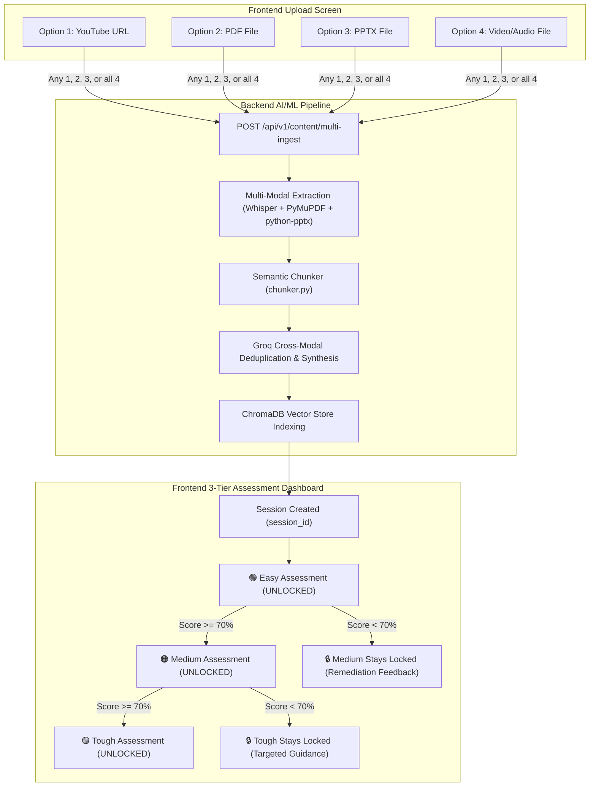

# Devraj's Frontend Integration Guide: GyanSetu Multi-Modal Ingestion & 3-Tier Gated Assessment

**Target Audience:** Devraj (Frontend Lead)  
**Backend/ML Engine:** GyanSetu AI/ML Architecture (FastAPI + Groq + ChromaDB + BKT/IRT)  
**Version:** 2.0 (Multi-Modal & Gated Assessment Release)

---

## 1. Executive Summary & Flowchart

GyanSetu allows learners to ingest **any combination of 4 learning sources** (simultaneously or individually):
1. **YouTube Video / Shorts Link**
2. **PDF Document** (Text, tables, scanned pages)
3. **PowerPoint Presentation (.pptx)**
4. **Local Video / Audio File (.mp4, .webm, .mp3, .wav)**

When multiple sources are uploaded together (e.g., a lecture video + the lecturer's PPT slides + a PDF reference note), the AI/ML pipeline:
- Transcribes and parses each source into semantic chunks.
- Uses **Groq LLM cross-modal deduplication** to detect overlapping concepts, remove redundancy, and preserve unique source insights.
- Stores the synthesized knowledge in **ChromaDB vector store**.
- Generates a **3-Tier Gated Assessment** (`Easy` ➡️ `Medium` ➡️ `Tough`).



---

## 2. Frontend Screen 1: Multi-Modal Ingestion Hub

### 2.1 UI Layout & User Interactions
Devraj, build a clean, modern card with **4 input tiles / drop zones**. The user must be allowed to provide:
* **Single input**: e.g., only a YouTube link, or only a PDF.
* **Dual input**: e.g., YouTube link + PDF notes.
* **Triple input**: e.g., YouTube link + PPTX presentation + PDF reading material.
* **All 4 inputs**: YouTube link + PDF + PPTX + MP4 video.

#### Input Fields
1. **YouTube Link Field**: Text input with URL validation regex (`https://youtube.com/...`, `https://youtu.be/...`).
2. **PDF Upload Tile**: Drag & drop zone accepting `.pdf`. Show uploaded filename, file size, and remove `(x)` button.
3. **PowerPoint Tile**: Drag & drop zone accepting `.pptx`. Show uploaded filename, file size, and remove `(x)` button.
4. **Video / Audio Tile**: Drag & drop zone accepting `.mp4`, `.webm`, `.mov`, `.mp3`, `.wav`, `.m4a`.
5. **Action Button**: Primary button labeled **"Process Content & Build Knowledge Base"**. Disabled if no inputs are filled.

---

### 2.2 Processing Progress Stepper (Live Feedback)
While the backend processes the files, show an animated stepper modal with 4 stages so the user knows what is happening:

```
[✓] 1. Extracting Text & Transcribing Audio (Groq Whisper)
[✓] 2. Segmenting into Semantic Knowledge Chunks
[🔄] 3. Cross-Modal Deduplication (Merging Video + Slides + Text via Groq)
[ ] 4. Indexing into Vector Database & Generating Assessment
```

---

## 3. Frontend Screen 2: 3-Tier Gated Assessment Dashboard

Once ingestion finishes, the user is navigated to the **Assessment Dashboard**.

### 3.1 The 3-Tier Button Cards

| Tier | Badge / Color | Difficulty | Cognitive Level (Bloom) | Initial State | Unlock Condition |
| :--- | :--- | :--- | :--- | :--- | :--- |
| **Tier 1: Easy** | 🟢 Green | Easy | Remember & Understand (Core definitions, terminology) | **UNLOCKED** | Always available |
| **Tier 2: Medium** | 🟠 Orange | Medium | Apply & Analyze (Formulas, real scenarios, calculations) | **LOCKED 🔒** | Must score **$\ge 70\%$** on Tier 1 (Easy) |
| **Tier 3: Tough** | 🟣 Purple | Hard | Evaluate & Synthesize (Workplace decision cases, policy trade-offs) | **LOCKED 🔒** | Must score **$\ge 70\%$** on Tier 2 (Medium) |

### 3.2 Behavior of Locked vs. Unlocked Buttons
* **Unlocked Button**:
  * Hover glow effect, active click state.
  * Shows button: **"Start Assessment (5 Questions)"**.
  * If already completed, displays badge: `Passed (80%)` with a **"Retake"** option.
* **Locked Button**:
  * Grayed-out background with a prominent lock icon `🔒`.
  * Disabled cursor (`not-allowed`).
  * Hovering displays a Tooltip:
    * Medium: *"Complete the Easy Assessment with at least 70% to unlock Medium."*
    * Tough: *"Complete the Medium Assessment with at least 70% to unlock Tough."*

---

## 4. Complete REST API Specifications

All endpoints use standard JSON or `multipart/form-data`. Base URL: `http://localhost:8000/api/v1` (or your configured backend host).

---

### 4.1 Content Ingestion Endpoint

#### `POST /api/v1/content/multi-ingest`
Submits 1 to 4 media types simultaneously.

* **Request Format:** `multipart/form-data`
* **Headers:** `Authorization: Bearer <JWT_TOKEN>` (optional if demo mode)
* **Form Fields:**

| Field Name | Type | Required? | Description |
| :--- | :--- | :--- | :--- |
| `youtube_url` | String | Optional | e.g. `https://www.youtube.com/watch?v=dQw4w9WgXcQ` |
| `pdf_file` | Binary File | Optional | File upload (`.pdf`) |
| `pptx_file` | Binary File | Optional | File upload (`.pptx`) |
| `video_file` | Binary File | Optional | File upload (`.mp4`, `.webm`, `.mp3`, `.wav`) |
| `title` | String | Optional | Custom title for the knowledge session (default: "My Study Session") |

> **Note:** At least **one** of `youtube_url`, `pdf_file`, `pptx_file`, or `video_file` must be provided!

#### Response Example (`200 OK`):
```json
{
  "status": "success",
  "session_id": "sess_9a8b7c6d5e4f",
  "title": "National Income & Sampling Methods",
  "ingested_sources": [
    {
      "source_type": "youtube",
      "identifier": "https://www.youtube.com/watch?v=dQw4w9WgXcQ",
      "method": "youtube_captions",
      "chunks_extracted": 14
    },
    {
      "source_type": "pptx",
      "filename": "Lecture_04_Sampling.pptx",
      "chunks_extracted": 8
    },
    {
      "source_type": "pdf",
      "filename": "UNSD_Census_Chapter2.pdf",
      "chunks_extracted": 22
    }
  ],
  "deduplication_summary": {
    "total_raw_chunks": 44,
    "synthesized_chunks": 29,
    "redundant_chunks_merged": 15,
    "cross_modal_insights_found": [
      "YouTube spoken explanation clarified Slide 4 formula on Stratified Sampling",
      "PDF Table 2.1 added statistical numerical constraints not found in slides"
    ]
  },
  "assessment_status": {
    "easy": { "unlocked": true, "completed": false, "score": null },
    "medium": { "unlocked": false, "completed": false, "score": null },
    "tough": { "unlocked": false, "completed": false, "score": null }
  }
}
```

---

### 4.2 Get Assessment Tier Status

#### `GET /api/v1/assessment/tiers?session_id={session_id}`
Returns current lock/unlock status and scores for each tier. Call this when the Assessment screen mounts.

#### Response Example (`200 OK`):
```json
{
  "session_id": "sess_9a8b7c6d5e4f",
  "tiers": {
    "easy": {
      "unlocked": true,
      "completed": true,
      "score": 80.0,
      "passing_score": 70.0,
      "questions_count": 5
    },
    "medium": {
      "unlocked": true,
      "completed": false,
      "score": null,
      "passing_score": 70.0,
      "questions_count": 5
    },
    "tough": {
      "unlocked": false,
      "completed": false,
      "score": null,
      "passing_score": 70.0,
      "unlock_requirement": "Pass Medium tier with >= 70%",
      "questions_count": 3
    }
  }
}
```

---

### 4.3 Get Tier Questions

#### `GET /api/v1/assessment/questions?session_id={session_id}&tier={easy|medium|tough}`
Fetches questions specifically generated and calibrated for the requested tier.

> **Validation:** If Devraj's app attempts to request `tier=medium` before `easy` is unlocked, backend returns `403 Forbidden` with `{ "detail": "TIER_LOCKED: Complete easy tier first" }`.

#### Response Example (`200 OK`):
```json
{
  "session_id": "sess_9a8b7c6d5e4f",
  "tier": "easy",
  "questions": [
    {
      "question_id": "q_101",
      "question_text": "In official statistics, which sampling method ensures every sub-population is proportionally represented?",
      "options": [
        { "id": "A", "text": "Stratified Random Sampling" },
        { "id": "B", "text": "Convenience Sampling" },
        { "id": "C", "text": "Snowball Sampling" },
        { "id": "D", "text": "Voluntary Response Sampling" }
      ],
      "source_reference": "Slide 4 (Lecture_04_Sampling.pptx)"
    },
    {
      "question_id": "q_102",
      "question_text": "What does CPI stand for in economic indicators?",
      "options": [
        { "id": "A", "text": "Central Price Index" },
        { "id": "B", "text": "Consumer Price Index" },
        { "id": "C", "text": "Commodity Production Indicator" },
        { "id": "D", "text": "Census Population Index" }
      ],
      "source_reference": "YouTube Video (01:24)"
    }
  ]
}
```

---

### 4.4 Submit Tier Answers & Unlock Next Level

#### `POST /api/v1/assessment/submit-tier`
Submits the user's answers, grades them, updates Bayesian Knowledge Tracing (BKT), and determines if the next tier unlocks.

#### Request Payload:
```json
{
  "session_id": "sess_9a8b7c6d5e4f",
  "tier": "easy",
  "answers": [
    { "question_id": "q_101", "selected_option": "A" },
    { "question_id": "q_102", "selected_option": "B" },
    { "question_id": "q_103", "selected_option": "C" },
    { "question_id": "q_104", "selected_option": "A" },
    { "question_id": "q_105", "selected_option": "D" }
  ]
}
```

#### Response Example (`200 OK` - Passed & Unlocked Next Tier):
```json
{
  "session_id": "sess_9a8b7c6d5e4f",
  "tier": "easy",
  "score_percentage": 80.0,
  "passed": true,
  "next_tier_unlocked": "medium",
  "message": "Congratulations! You passed the Easy assessment and unlocked Medium.",
  "results": [
    {
      "question_id": "q_101",
      "is_correct": true,
      "user_selected": "A",
      "correct_option": "A",
      "explanation": "Stratified random sampling partitions the population into homogeneous strata before sampling.",
      "misconception": null
    },
    {
      "question_id": "q_103",
      "is_correct": false,
      "user_selected": "C",
      "correct_option": "A",
      "explanation": "Nominal GDP is not adjusted for inflation, whereas Real GDP is adjusted using a GDP deflator.",
      "misconception": "conceptual_confusion"
    }
  ],
  "learning_state": {
    "bkt_mastery_probability": 0.78,
    "recommended_action": "Proceed to Medium Tier"
  }
}
```

---

## 5. Frontend UI/UX Recommendations for Devraj

1. **Upload Experience:**
   - Allow users to drag a file directly into the corresponding box or click to browse.
   - Show green checkmarks `✓` next to whichever inputs are populated.
   - Display a clean summary banner: *"3 sources selected: 1 YouTube link, 1 PPTX, 1 PDF"*.

2. **Assessment Gating Experience:**
   - When a user finishes the Easy tier and gets $\ge 70\%$, trigger a celebratory unlock animation (e.g. confetti or glowing padlock opening) on the **Medium** button!
   - If they score $< 70\%$, show a supportive card: *"You scored 60%. Review the highlighted explanations below and retake Easy to unlock Medium."*
   - Save session state to `localStorage` or URL query params (`?session_id=...`) so if the user refreshes, their unlocked tiers and progress remain intact.

3. **Grounded RAG Chatbot Tab (Bonus Feature):**
   - Provide a side drawer or tab where users can ask questions about their uploaded content:
   - Endpoint: `POST /api/v1/chatbot/query` with `{ "session_id": "...", "query": "Explain Slide 4" }`.
   - The chatbot only answers using the synthesized multi-source ChromaDB knowledge base with cited source names!

---

Devraj, all backend and AI/ML engines are calibrated and ready to connect to these routes!
