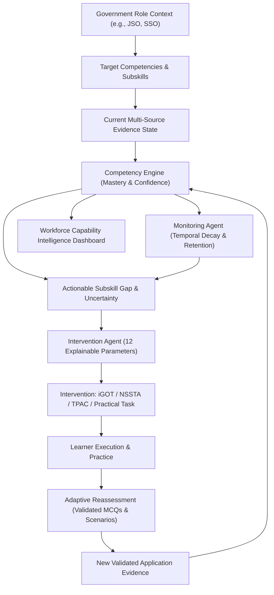
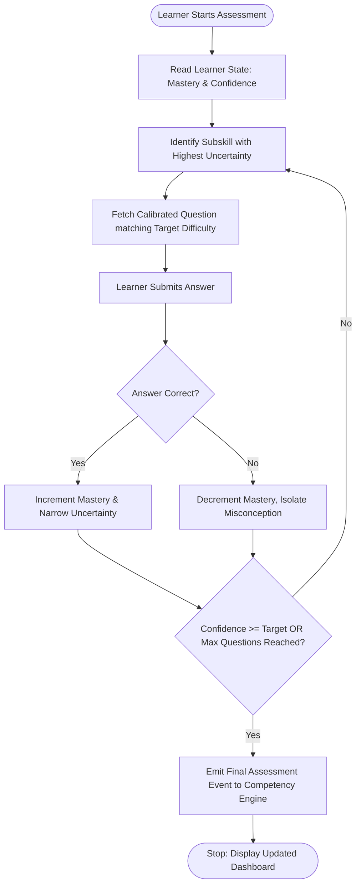

# GyanSetu — AI/ML System Architecture Specification

> **Target Audience:** Evaluators, System Architects, Technical Judges, and Engineering Team  
> **System:** GyanSetu (SIH PS 26101 — Capacity Building in India's Official Statistical System)  
> **Authoritative Sources:** `GyanSetu_IDEA (2).md`, `GyanSetu_BUILD_GUIDE (2).md`, and the `ml_pipeline/` Implementation  
> **Hardware & Model Environment:** Groq LPU Inference (Open-weight LLMs via OpenAI-compatible API) + Local Sentence Transformers & Whisper + Embedded ChromaDB  
> **Last Updated:** September 2026

---

## 1. Executive Summary & Core Architectural Premise

### 1.1 The Fundamental Paradigm Shift: Course Completion $\ne$ Competency Mastery
Standard learning platforms (LMS) and existing portals monitor **activity signals**:
```text
Officer enrolled → Watched video / read PDF → Completed course → Certificate issued
```
In high-stakes technical organizations like India's **Ministry of Statistics and Programme Implementation (MoSPI)**, course completion does not prove an officer can perform complex stratified sampling, identify non-sampling errors, or audit national accounts. 

**GyanSetu establishes competency state as the central product object:**
$$\text{Competency State} = f(\text{Multi-Source Evidence}, \text{Recency}, \text{Assessment Difficulty}, \text{Practical Demonstration})$$

### 1.2 The Definitive Closed-Loop Lifecycle
Every AI/ML component in GyanSetu exists solely to power and verify this continuous cycle:



---

## 2. High-Level System Architecture

GyanSetu separates responsibilities into three major tiers: **Frontend Client**, **Backend Orchestrator**, and **ML/AI Intelligence Engine**, backed by local vector storage and relational state persistence.

```text
┌──────────────────────────────────────────────────────────────────────────────────┐
│                         FRONTEND LAYER (Next.js 14+)                             │
│  • Competency Radar & State Cards (Mastery, Confidence, Coverage, Recency)       │
│  • Adaptive Diagnostic Assessment UI (Real-time single-question updates)         │
│  • Explainable Next-Best-Action Card (12 Structured Justification Fields)        │
│  • Scenario-Based Practical Task UI (Progressive Type A: Data + Decision Rubric)  │
│  • Grounded Virtual Assistant Chatbot Interface with Strict Page Citations       │
│  • Real-Time Agent Activity Timeline (Audit trail: Orchestrator, Diag, Interv)   │
│  • Admin Workforce Capability Radar ([SANDBOX DATA] Aggregations)                │
└────────────────────────────────────────┬─────────────────────────────────────────┘
                                         │ REST API (JSON over HTTP / CORS)
┌────────────────────────────────────────▼─────────────────────────────────────────┐
│                    BACKEND ORCHESTRATION LAYER (FastAPI)                         │
│  • Server-Side RBAC & Auth (/api/v1/ protected endpoints)                        │
│  • System Orchestrator (Deterministic Event Routing & State Synchronization)     │
│  • Competency Engine (Deterministic Multi-Source Evidence Fusion & Scoring)      │
│  • Normalized Provider Adapters (iGOT, NSSTA, TPAC in LIVE / SANDBOX / REPLAY)   │
│  • Decision & Audit Logger (Transparent tracking of autonomous suggestions)      │
│  • Safe State Engine (Atomic database transactions; zero partial state writes)   │
└────────────────────────────────────────┬─────────────────────────────────────────┘
                                         │ Internal Python Service Interface
┌────────────────────────────────────────▼─────────────────────────────────────────┐
│                       ML / AI INTELLIGENCE PIPELINE                              │
│                                                                                  │
│   1. INGESTION & PARSING          2. COMPILATION & MAPPING                       │
│   ├── PyMuPDF (PDF Parser)        ├── concept_extractor.py                       │
│   ├── python-pptx (PPT Parser)    ├── competency_mapper.py                       │
│   ├── Local Whisper ASR (Video)   └── Official Statistics Competency Graph       │
│   └── 9-Class Ingestion Failure       (Statistical, Technical, Governance)      │
│                                                                                  │
│   3. ITEM GENERATION & QUALITY    4. ADAPTIVE DIAGNOSTICS & CHATBOT              │
│   ├── mcq_generator.py            ├── adaptive_selector.py (Uncertainty Min)     │
│   ├── scenario_generator.py       ├── chatbot.py (Grounded RAG Assistant)        │
│   ├── mcq_validator.py (6 Gates)  ├── misconception_classifier.py                │
│   └── mcq_scorer.py               └── explanation_generator.py                   │
└───────────────────────┬──────────────────────────────────┬───────────────────────┘
                        │                                  │
          Vectors & Semantic Search                 LLM Generation & Reasoning
                        ▼                                  ▼
        ┌───────────────────────────────┐  ┌──────────────────────────────────────┐
        │   ChromaDB (Local Vector DB)  │  │         Groq LPU API                 │
        │   Sentence Transformers       │  │   (Open-Weight Models: Llama 3/Qwen) │
        │   (all-MiniLM-L6-v2)          │  │   Low-latency JSON completions       │
        └───────────────────────────────┘  └──────────────────────────────────────┘
```

---

## 3. Technology Stack & Operational Reality

| Component | Technology / Library | Architectural Role | Operational Justification |
|---|---|---|---|
| **LLM Provider** | **Groq API** (`GROQ_API_KEY`) | Question generation, scenario synthesis, concept extraction, chatbot | Ultra-low latency LPU hardware; runs open-weight models (Llama 3 / Qwen) via OpenAI-compatible endpoint. |
| **LLM Orchestration** | **LangChain** | Prompt templates, output parsers, retrieval chains | Enforces rigid JSON extraction and handles retrieval-augmentation flows. |
| **Vector Database** | **ChromaDB** (Embedded) | Local vector storage and semantic chunk retrieval | Completely free, embedded, file-backed; zero cloud dependencies for hackathon demos. |
| **Embeddings** | **Sentence Transformers** (`all-MiniLM-L6-v2`) | Text similarity, grounding validation, semantic chunk search | Runs locally on CPU; deterministic vector representations. |
| **Document Parsing** | **PyMuPDF (`fitz`)**, **`python-pptx`** | Text & table extraction from government reports and slide decks | High-speed, handles layout formatting without external OCR services. |
| **Audio / Video ASR** | **OpenAI Whisper (`tiny` / `base`)** | Speech-to-text transcription of training lectures | Fully local offline transcription; extracts timestamped dialogue. |
| **Evidence Math** | **`scikit-learn` & Python Math** | Item scoring, competency uncertainty, baseline decay functions | Transparent, deterministic calculations—no LLM hallucinations in scoring. |

---

## 4. Subsystem Deep-Dive

### 4.1 Module 1: Multimodal Ingestion & Content Processing Pipeline
*Implementation: `ml_pipeline/document_processor.py`, `ml_pipeline/chunker.py`*

Government training content comes in unstructured formats (MoSPI circulars, NSSTA slide decks, survey training lectures). The ingestion engine converts these into structured, searchable learning artifacts:

```text
Uploaded File (.pdf, .pptx, .mp4)
       ↓
[Format Router]
├── PDF: PyMuPDF extracts text, bounding blocks, and page metadata.
├── PPTX: python-pptx extracts slide text, speaker notes, and hierarchy.
└── MP4: Audio extraction (FFmpeg) → Whisper ASR generates timestamped transcript.
       ↓
[9-Category Ingestion Failure Governance]
Evaluates raw extraction against explicit failure states:
├── UNSUPPORTED_FORMAT       ├── OCR_FAILURE             ├── PROCESSING_TIMEOUT
├── CORRUPTED_FILE           ├── ASR_FAILURE             ├── MAPPING_FAILURE
└── EMPTY_CONTENT            ├── PARTIAL_EXTRACTION      └── UNKNOWN_PROCESSING_ERROR
       ↓
[Semantic Chunker (`chunker.py`)]
Splits text into chunks of 500–1000 characters with 100-character overlap.
Preserves metadata: {source_file, page_number, slide_number, timestamp}.
       ↓
[Vector Database Storage (`vector_store.py`)]
Embeds chunks via Sentence Transformers into ChromaDB collections:
├── `training_content`: Curated training manuals & curricula.
└── `assessment_context`: Domain context for grounding validation.
```

> **The Coverage Rule:** If `PARTIAL_EXTRACTION` occurs (e.g., corrupted pages in a scanned PDF), the pipeline calculates `extraction_coverage = successful_pages / total_pages`. If coverage is below $80\%$, the system logs a warning and **strictly refuses to generate trusted assessment items**.

---

### 4.2 Module 2: Content-to-Competency Compiler
*Implementation: `ml_pipeline/concept_extractor.py`, `ml_pipeline/competency_mapper.py`*

Instead of treating documents as dumb text chunks, GyanSetu compiles them into a structured **Competency Knowledge Graph**:

```text
Raw Text Chunks
       ↓
[Concept Extractor (`concept_extractor.py`)]
Groq LLM extracts:
• Concept Name (e.g., "Stratified Random Sampling")
• Definition & Key Principles
• Mathematical Formulae & Assumptions
• Prerequisite Concepts (e.g., "Simple Random Sampling", "Variance")
       ↓
[Competency Mapper (`competency_mapper.py`)]
Embeds extracted concepts and calculates cosine similarity against the 
MoSPI 4-Domain Competency Taxonomy:
├── 1. STATISTICAL: Survey Design, Sampling, National Accounts, Price Statistics, Index Numbers
├── 2. TECHNICAL: Python for Statistics, R, SQL, Stata, GIS, Big Data Pipeline
├── 3. DIGITAL GOVERNANCE: Data Privacy, Cybersecurity, DPI, Data Quality Assurance
└── 4. BEHAVIOURAL / MANAGERIAL: Ethics in Data Collection, Team Leadership, Official Reporting
       ↓
Outputs Formal Mappings:
{
  "concept": "Neyman Allocation",
  "domain": "Statistical",
  "competency": "Sampling Design",
  "subskill": "Variance Estimation in Stratified Sampling",
  "prerequisites": ["Stratified Sampling", "Population Variance"],
  "cognitive_level": "Application",
  "confidence_score": 0.89
}
```

---

### 4.3 Module 3: AI Assessment Item Generation & 6-Gate Quality Governance
*Implementation: `ml_pipeline/mcq_generator.py`, `ml_pipeline/mcq_validator.py`, `ml_pipeline/mcq_scorer.py`, `ml_pipeline/scenario_generator.py`*

Automatic MCQ generation is a mandated SIH requirement, but unvalidated GenAI questions cause severe assessment errors. GyanSetu wraps generation in an automated 6-stage validation pipeline:

```text
Source Text Chunk + Target Subskill + Cognitive Level
       ↓
[Generation Prompt (`mcq_generator.py`)]
Directs Groq LLM under strict constraints:
• Grounded ONLY in the supplied text chunk (no outside knowledge hallucination).
• Exactly ONE unambiguous correct answer.
• Distractors must be plausible (reflect real statistical mistakes) but strictly false under stated conditions.
• Generates scenario-based practical problems rather than simple dictionary recall.
       ↓
[6-Stage Automated Validation Pipeline (`mcq_validator.py`)]
├── GATE 1: SCHEMA INTEGRITY
│   Verifies JSON structure, exactly 4 options (A, B, C, D), valid answer key, and complete explanation.
├── GATE 2: ANSWER UNAMBIGUITY
│   Verifies correct_answer key matches exactly one option. Checks for "all of the above" anti-patterns.
├── GATE 3: SEMANTIC GROUNDING CHECK
│   Sentence Transformers calculates cosine similarity between the correct answer + explanation 
│   and the source text chunk. Threshold: similarity >= 0.45. If lower, flagged as ungrounded.
├── GATE 4: DISTRACTOR PLAUSIBILITY & SEPARATION
│   Ensures distractors have semantic similarity to the domain (plausible) but are sufficiently 
│   separated from the correct answer (not ambiguous).
├── GATE 5: DUPLICATE & OVERLAP FILTER
│   Cosine similarity check against existing items in the assessment bank to prevent redundant testing.
└── GATE 6: QUALITY SCORE CALCULATION (`mcq_scorer.py`)
    Calculates composite score Q in [0.0, 1.0].
    • If Q >= 0.70: PASSED → Written to active Assessment Bank.
    • If 0.50 <= Q < 0.70: REVIEW → Quarantined for SME human review.
    • If Q < 0.50: REJECTED → Discarded; regeneration triggered.
```

#### Progressive Practical Tasks (Virtual Lab Alternative)
Arbitrary code execution containers (Docker sandboxes) introduce critical security and timeout vulnerabilities during production and hackathons. GyanSetu solves this using a progressive 3-tier task model:
* **Type A — Scenario-Based Practical Task (`scenario_generator.py`, `scenario_evaluator.py`):**  
  Presents a statistical scenario (e.g., *"Survey non-response across rural agricultural strata"*), a data summary table, and requires the learner to select methodological steps, calculate allocations, and justify choices. Evaluated against a multi-criterion rubric. Generates **Level 3 Practical Evidence** without arbitrary code execution risk.
* **Type B — Controlled Interactive Task:** Parameterized sliders for statistical models on controlled datasets.
* **Type C — Executable Docker Laboratory:** Full code sandbox (optional extension).

---

### 4.4 Module 4: Adaptive Diagnostic Engine
*Implementation: `ml_pipeline/adaptive_selector.py`*

Instead of delivering static quizzes, the **Diagnostic Agent** dynamically routes items to minimize competency uncertainty:



* **Adaptive Selection Rule:**
  * If a learner succeeds on a medium-difficulty question $\rightarrow$ Select a higher-difficulty application scenario.
  * If a learner fails $\rightarrow$ Select prerequisite knowledge items to determine whether the failure stems from basic recall or procedural misunderstanding.
* **Diagnostic Burden:** Reduces question count by $\ge 30\%$ compared to static tests while maintaining equal diagnostic accuracy.

---

### 4.5 Module 5: Deterministic Competency Engine & Evidence Fusion
*Implementation: Backend Service*

> **Critical Architecture Rule:** The Competency Engine is a **deterministic statistical backend service**, NOT an LLM.

#### 1. The 6-Level Evidence Hierarchy
GyanSetu recognizes that not all learning activities carry equal weight:
* **Level 5 — Workplace Application:** Verified deployment of statistical techniques in MoSPI reports/fieldwork.
* **Level 4 — Repeated Performance:** Consistent success across multiple assessments separated over time.
* **Level 3 — Practical Task Evidence:** High performance on Scenario-Based Type A tasks.
* **Level 2 — Assessment Evidence:** Validated adaptive diagnostic MCQs and quizzes.
* **Level 1 — Training Evidence:** iGOT or NSSTA course completion records (activity only).
* **Level 0 — Profile Context:** Job role, designation, past qualifications (contextual baseline only).

#### 2. Mathematical State Representation
For each competency $k$ and subskill $s$, the state vector stores:
$$\mathbf{S}_{k,s} = \langle \hat{\theta}, \gamma, \omega, \tau, \delta \rangle$$
* $\hat{\theta} \in [0.0, 1.0]$: **Estimated Mastery** (how well the official understands the skill).
* $\gamma \in [0.0, 1.0]$: **Evidence Confidence** (statistical certainty of the estimate).
* $\omega \in [0.0, 1.0]$: **Evidence Coverage** (fraction of subskills tested).
* $\tau \in \mathbb{R}^+$: **Recency / Freshness** (time-decayed weight based on elapsed days).
* $\delta \in [0.0, 1.0]$: **Evidence Diversity** (entropy over Level 1–5 evidence sources).

#### 3. The Cardinal Invariant: *No Evidence $\ne$ Low Competency*
* When an officer has no records for a competency, $\hat{\theta}$ is unset (or default baseline) and $\gamma \approx 0.0$ (Low Confidence).
* **Low Confidence triggers a Diagnostic recommendation.**
* **Low Mastery with High Confidence triggers an Intervention recommendation.**

---

### 4.6 Module 6: The 4-Agent Orchestration Architecture

```text
┌─────────────────────────────────────────────────────────────────────────────┐
│                             GYANSETU ORCHESTRATOR                           │
│  • Deterministic event router and workflow coordinator                      │
│  • Manages transitions between Diagnostic, Intervention, and Monitoring     │
│  • Emits structured events to the Agent Activity Timeline                   │
└──────────────┬──────────────────────────────┬───────────────────────────────┘
               │                              │
               ▼                              ▼
┌──────────────────────────────┐┌─────────────────────────────────────────────┐
│       DIAGNOSTIC AGENT       ││             INTERVENTION AGENT              │
│• Queries Competency Engine   ││• Formulates Next Best Action                │
│• Locates uncertainty gaps    ││• Evaluates options across 12 explainable    │
│• Selects optimal adaptive    ││  parameters: role relevance, gap severity,  │
│  questions                   ││  evidence confidence, prerequisites, etc.   │
│• Detects misconception trends││• Interacts strictly via Normalized Adapters │
└──────────────┬───────────────┘└─────────────┬───────────────────────────────┘
               │                              │
               └──────────────┬───────────────┘
                              ▼
┌─────────────────────────────────────────────────────────────────────────────┐
│                              MONITORING AGENT                               │
│  • Listens for post-training completion and new assessment submissions      │
│  • Evaluates temporal decay (knowledge forgetting curve)                   │
│  • Automatically schedules delayed retention verifications (e.g., Day 7)     │
│  • Flags contradictory evidence (e.g., high MCQ score but failed scenario)  │
└─────────────────────────────────────────────────────────────────────────────┘
```

#### Normalized Adapter Architecture (iGOT / NSSTA / TPAC)
The Intervention Agent **never invents courses**. It only recommends resources returned by normalized adapters conforming to a strict schema:
```json
{
  "provider": "igot",
  "resource_id": "crs_sampling_02",
  "resource_type": "course",
  "title": "Stratified Sampling in Official Statistics",
  "competencies": ["Sampling Design"],
  "subskills": ["Variance Estimation in Stratified Sampling"],
  "duration_minutes": 120,
  "modality": "online",
  "source_mode": "SANDBOX"
}
```
* **Adapter Execution Modes:** `LIVE` (real API), `SANDBOX` (approved mock payload), `REPLAY` (historical demo data).

---

### 4.7 Module 7: Learning Science, Retention & Misconception Memory
*Implementation: `ml_pipeline/misconception_classifier.py`*

* **Temporal Decay Function:** Evidence weights decay as time elapses without practice:
  $$w(t) = w_0 \cdot e^{-\lambda t}$$
  When an officer's recency drops below threshold, the **Monitoring Agent** flags the competency as *Stale* and schedules a 3-minute retrieval check instead of re-assigning a 40-hour course.
* **Misconception Memory:**  
  When a learner selects a specific distractor repeatedly, `misconception_classifier.py` catalogs the conceptual error (e.g., *"Confuses standard error of the mean with population standard deviation"*). The system serves **contrastive micro-learning explanations** targeting the exact confusion.
* **Hackathon Replay Badges:**  
  Because true retention requires 7–14 days, the demo demonstrates this functionality transparently using `[REPLAY — HISTORICAL SANDBOX EVENT]` tags.

---

### 4.8 Module 8: Grounded Virtual Assistant (RAG Chatbot)
*Implementation: `ml_pipeline/chatbot.py`, `ml_pipeline/vector_store.py`*

The virtual assistant provides learners with direct conversational guidance on official statistics material and explains system recommendations.

```text
User Question: "What is the difference between Neyman and Proportional allocation?"
       ↓
[Embedding & ChromaDB Semantic Search]
Sentence Transformers embeds the query and retrieves the top 3 chunks 
from official NSSTA guidelines with similarity scores.
       ↓
[Similarity Evaluation & Strict Abstention Gate]
• If top chunk similarity < 0.40:
  DO NOT call LLM. Return immediately:
  "I don't have enough verified information in official training materials to answer accurately."
       ↓
• If top chunk similarity >= 0.40:
  [Grounded Prompt Synthesis]
  Passes retrieved chunks + query to Groq LLM with strict system prompt:
  - Base the answer ONLY on the retrieved text.
  - Cite the document name and page number.
  - Abstain if the context does not explicitly answer the question.
       ↓
Structured Output:
{
  "answer": "Under Proportional allocation, sample size is proportional to stratum size...",
  "citations": [
    {"source": "NSSTA_Sampling_Manual.pdf", "page": 45, "paragraph": 2}
  ],
  "abstention": false
}
```

---

## 5. 4-Tier Bulletproof Fallback Hierarchy

To guarantee that the platform never crashes on stage during live evaluations or in low-connectivity government environments, all AI services adhere to a 4-tier degradation strategy:

```text
Tier 1: LIVE LLM (Groq API on LPU Hardware)
  │ (Fails on rate limit / HTTP 429 / network timeout)
  ▼
Tier 2: VALIDATED CACHE (Pre-generated & verified response bank in ChromaDB)
  │ (Fails on cache miss / offline demonstration mode)
  ▼
Tier 3: CURATED QUESTION BANK (Hand-verified official MoSPI statistical questions in SQLite/Postgres)
  │ (Fails on unsupported query / missing document)
  ▼
Tier 4: DETERMINISTIC FALLBACK (Rule-based template: "Insufficient verified information available")
```

---

## 6. Complete 16-Class Failure Handling Taxonomy ($G_1$ to $G_{16}$)

GyanSetu treats edge cases systematically via a closed-loop taxonomy: **Detect $\rightarrow$ Diagnose $\rightarrow$ Safe Action $\rightarrow$ Log Event $\rightarrow$ Structured Review**.

| Code | Failure Class | Detection Mechanism | System Safe Action |
|---|---|---|---|
| **$G_1$** | **Insufficient Evidence** | Coverage $< 0.30$ or Confidence $< 0.40$ | Widen uncertainty band; Diagnostic Agent triggers assessment. |
| **$G_2$** | **Conflicting Evidence** | Level 2 MCQ score high ($\ge 0.85$), but Level 3 Scenario fails ($< 0.40$) | Flag contradiction; prioritize practical verification task. |
| **$G_3$** | **Low-Quality Assessment Item** | Automated validator score $< 0.60$ | Quarantine item in database; serve pre-validated Tier 2 replacement. |
| **$G_4$** | **Incorrect Competency Mapping** | Mapping confidence score $< 0.50$ | Flag mapping for administrator / curriculum review. |
| **$G_5$** | **Stale Competency State** | Last evidence timestamp $> 90$ days | Monitoring Agent triggers scheduled retrieval check. |
| **$G_6$** | **Recommendation Mismatch** | Learner prerequisite not met for course | Re-rank candidates; recommend prerequisite module first. |
| **$G_7$** | **Ambiguous Learner Response** | Response time abnormally low ($< 3$s) with erratic answers | Request clarification or serve alternative verification item. |
| **$G_8$** | **RAG Retrieval Failure** | ChromaDB unreachable or cosine similarity $< 0.40$ | Strict abstention (*"Insufficient verified information in official sources"*). |
| **$G_9$** | **Model Uncertainty** | LLM output parsing failure or entropy high | Widen confidence interval; fallback to Tier 3 curated items. |
| **$G_{10}$** | **Insufficient Content Coverage** | Document parser extraction coverage $< 80\%$ | Mark content incomplete; strictly prohibit generating trusted items. |
| **$G_{11}$** | **External Integration Failure** | Provider endpoint timeout / failure | Switch adapter mode to `SANDBOX` or `REPLAY`. |
| **$G_{12}$** | **Content Processing Failure** | Unsupported file or OCR/ASR failure | Categorize into 1 of 9 ingestion errors; notify uploader. |
| **$G_{13}$** | **Translation / Terminology Drift** | Hindi translation deviates from official glossary | Revert to standard official MoSPI bilingual statistical terminology. |
| **$G_{14}$** | **Authorization Failure** | Unauthorized attempt to access officer data | Reject with 403 Forbidden; log security audit event. |
| **$G_{15}$** | **Database Failure** | Write collision or database unreachable | Abort transaction; enter safe read-only sandbox mode. |
| **$G_{16}$** | **API Contract Failure** | Payload fails Pydantic schema validation | Return structured JSON error envelope with `request_id`. |

---

## 7. Security, Guardrails & Claim Integrity

### 7.1 Untrusted Content Boundary
* All uploaded PDFs, PPTs, videos, user answers, and external API responses are treated as **UNTRUSTED DATA**.
* Raw text is strictly isolated inside prompt data blocks (`{content}`) and never concatenated into system instructions.
* Untrusted content can never override grading rubrics, alter prompt instructions, or bypass server-side role-based authorization.

### 7.2 Anti-Circularity Rule
* An LLM that generates an assessment item is **never** the sole evaluator of whether the question or the student's answer is correct.
* Evaluation is grounded in deterministic rubric checks, embedding similarity thresholds against original source texts, and human-in-the-loop SME review.

### 7.3 The Definitive "Do Not Claim" List
To maintain maximum credibility during technical judging:
1. **DO NOT CLAIM:** *"Our AI knows the officer's true competency with 100% certainty."*  
   $\rightarrow$ **CLAIM:** *"The system maintains an estimated competency state with explicit confidence bounds and evidence provenance."*
2. **DO NOT CLAIM:** *"We scrape authenticated government portals with Chrome extensions or OTPs."*  
   $\rightarrow$ **CLAIM:** *"We utilize normalized integration adapters operating in Live, Sandbox, or Replay modes."*
3. **DO NOT CLAIM:** *"We provide a full cloud Docker execution sandbox for arbitrary Python/R code."*  
   $\rightarrow$ **CLAIM:** *"We implement a progressive Scenario-Based Practical Task (Type A) that evaluates analytical decision-making without security vulnerabilities."*
4. **DO NOT CLAIM:** *"Our LLM generated 100% perfect questions automatically."*  
   $\rightarrow$ **CLAIM:** *"Our LLM generates candidates which must pass a 6-stage automated validation pipeline, semantic grounding check, and psychometric monitoring."*

---

## 8. Competency Engine Evaluation Ladder (E0 to E4)

To prevent premature deployment of unvalidated machine learning models, GyanSetu defines a 5-step evaluation progression:
* **E0 — Heuristic Baseline:** Transparent rule-based weighted averaging across available assessment scores.
* **E1 — Evidence-Weighted Estimation:** Incorporates evidence strength tiers (Level 0 to Level 3) into the estimate.
* **E2 — Multi-Source Evidence Fusion:** Combines knowledge assessments, scenario decisions, and recency decay.
* **E3 — Adaptive Assessment-Aware Estimation:** Integrates item difficulty and discrimination into the scoring model (IRT-grounded).
* **E4 — Final Calibrated Model:** Fully bench-tested model validated against real student response corpora.

---

## 9. Codebase Directory Mapping (`ml_pipeline/`)

The architecture maps directly to the actual files in `likhita-ml-remaining-work/ml_pipeline/`:

```text
likhita-ml-remaining-work/ml_pipeline/
├── document_processor.py           # Ingestion for PDF, PPTX, and video transcripts
├── chunker.py                      # Semantic chunking with overlap & metadata preservation
├── concept_extractor.py            # LLM extraction of atomic statistical concepts
├── competency_mapper.py            # Cosine-similarity mapping to MoSPI 4-domain taxonomy
├── mcq_generator.py                # Prompt-constrained MCQ generation via Groq
├── mcq_validator.py                # 6-stage validation pipeline (schema, grounding, distractors)
├── mcq_scorer.py                   # Automated quality scoring for generated items
├── scenario_generator.py           # Scenario-Based Practical Task generation (Type A)
├── scenario_evaluator.py           # Rubric-based evaluation of scenario responses
├── adaptive_selector.py            # Uncertainty-minimizing adaptive question router
├── misconception_classifier.py     # Recurring error detection and targeted contrastive explanations
├── chatbot.py                      # Grounded RAG assistant with strict citation & abstention
├── vector_store.py                 # ChromaDB client & Sentence Transformers embeddings wrapper
├── resource_recommender.py         # 12-attribute explainable recommendation engine
├── real_resource_mapper.py         # Normalization adapters for iGOT, NSSTA, and TPAC resources
├── audit_pipeline.py               # Audit logger for agent actions and state mutations
└── api_interface.py                # Python API interface connecting ML pipeline to FastAPI
```

---

## 10. Summary for Presentations

> **In 30 seconds:**  
> *"GyanSetu transforms learning from passive course completion into an evidence-driven competency operating system. We ingest MoSPI documents and training videos, compile them into an Official Statistics Competency Graph, and generate psychometrically validated assessments via Groq-accelerated open LLMs and local embedding grounding gates. Our Diagnostic Agent identifies precise subskill gaps through adaptive testing; our Competency Engine fuses multi-source evidence into dual mastery and confidence metrics; our Intervention Agent delivers transparent 12-factor recommendations across iGOT, NSSTA, and practical tasks; and our Monitoring Agent ensures skills are retained over time—all backed by a 4-tier fallback hierarchy and strict anti-hallucination guardrails."*
